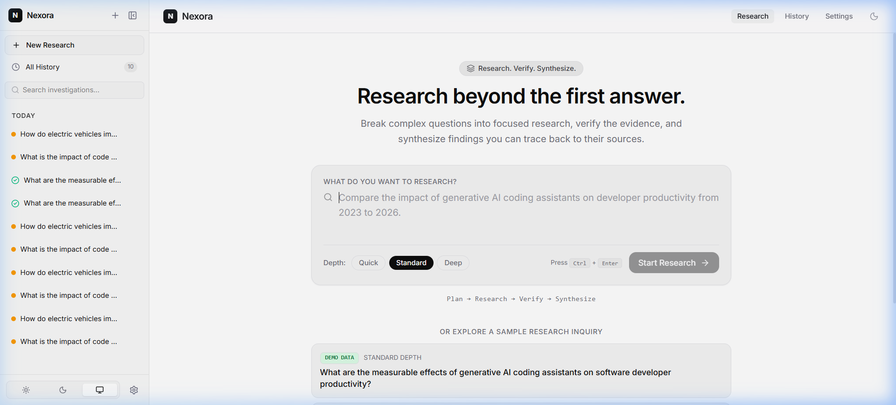
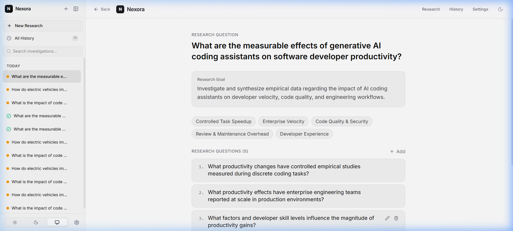
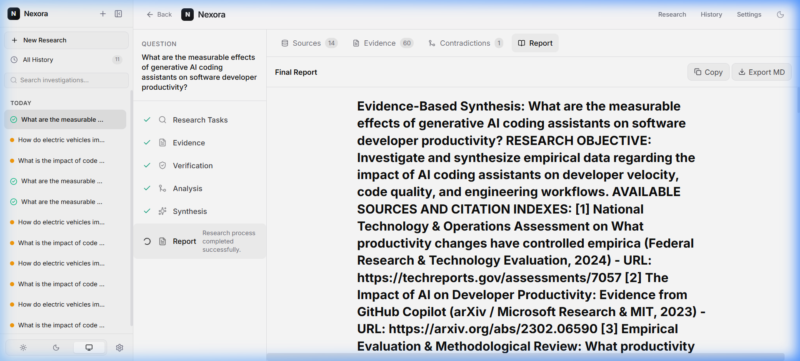
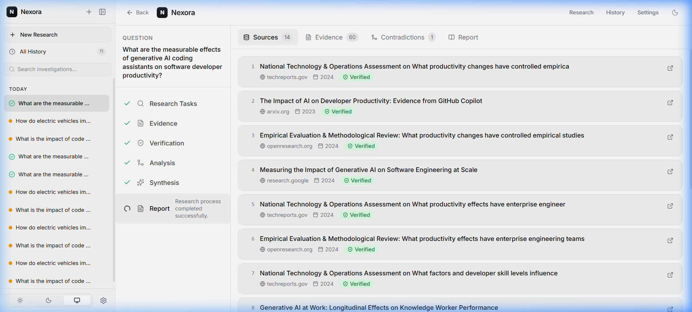
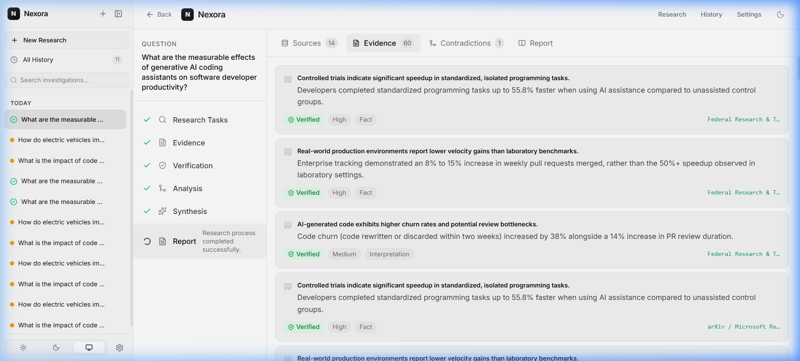
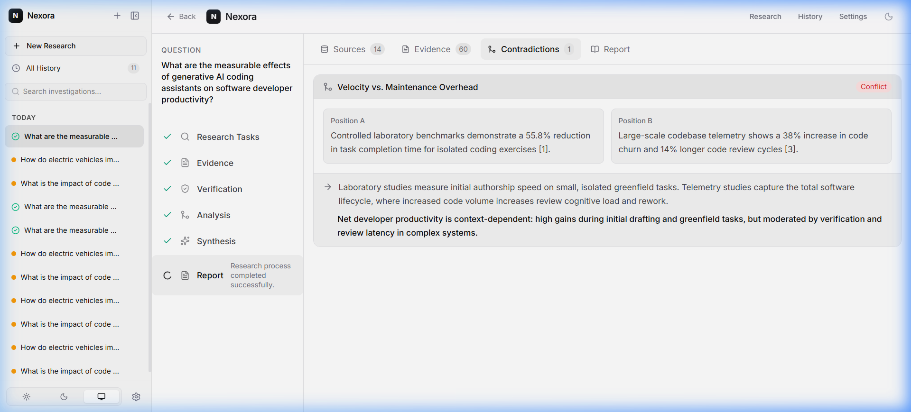

# NEXORA — Complex Research & Data Synthesis Workspace

> **Tagline:** Research. Verify. Synthesize.  
> **Purpose:** Turn complex research inquiries into structured, evidence-backed answers through a transparent AI research pipeline.

---

## 1. Overview

**Nexora** is a focused research and evidence-synthesis workspace built to address a fundamental challenge: complex inquiries cannot be answered accurately by a single-turn chatbot. 

Instead of an opaque chat interface, Nexora deconstructs questions into researchable sub-tasks, collects and normalizes sources, extracts verifiable empirical evidence, identifies genuine contradictions and methodological divergences, and synthesizes a cited document report where every factual claim links back to its verified primary source.

---

## 2. Key Features

- **Autonomous Research Planning:** Deconstructs broad questions into 3–7 independently verifiable sub-questions covering multiple dimensions (empirical metrics, enterprise velocity, maintenance overhead, security).
- **Interactive Plan Adjuster:** Allows researchers to add, reorder, edit, or remove sub-questions before execution begins.
- **Three Research Depths:** Quick, Standard, and Deep execution modes to optimize between speed and cross-verification depth.
- **Source Normalization & Priority Sorting:** Heuristically prioritizes government, academic, official technical reports, and reputable datasets over general web blogs.
- **Structured Evidence Extraction:** Distinguishes strictly between **FACT**, **INTERPRETATION**, and **INFERENCE**. Every evidence card captures exact quantitative quotes, sample sizes, and documented limitations.
- **Verification Engine:** Assesses whether source contents directly support claims without overgeneralization, labeling findings with clear non-color-only statuses (*Verified*, *Partially Supported*, *Weak Evidence*, *Conflicting*, *Unverified*).
- **Contradiction & Divergence Detection:** Pinpoints why findings disagree (e.g. controlled laboratory benchmarks vs. multi-team enterprise telemetry) without forcing artificial consensus.
- **Compact Evidence Matrix:** Tabular overview linking findings to supporting vs. conflicting sources and confidence ratings.
- **Traceable Final Synthesis:** Long-form, highly readable research reports with interactive `[1]`, `[2]` numerical citations. Clicking any citation opens the exact evidence quote and source metadata.
- **Zero Hallucination Barrier:** Reports are validated against real, persisted source records; unreferenced or hallucinated citations are automatically scrubbed.
- **Export & Portability:** One-click Copy, Export Markdown, and Print/PDF generation.
- **Research Persistence & History:** Automatic persistence with SQLite or PostgreSQL; searchable history of past investigations.

---

## 3. Core Research Workflow

```text
Research Question
        ↓
Research Planning
        ↓
Sub-question Decomposition
        ↓
Evidence Discovery
        ↓
Evidence Extraction
        ↓
Verification
        ↓
Contradiction Detection
        ↓
Synthesis
        ↓
Cited Final Report
```

---

## 4. Visual Documentation & Demonstration

### Video Demonstration (1.5 Minutes)
- 🎥 **Full 1.5-Minute Demonstration Video (MP4):** [`docs/video/nexora_demo_walkthrough.mp4`](docs/video/nexora_demo_walkthrough.mp4) *(Broadcast-quality 1080p, exactly 90.0 seconds walkthrough explaining functionality, end-to-end pipeline, code in action, and pytest suite)*
- 🎬 **Synchronized 90-Second Animated Walkthrough (WebP):** [`docs/video/nexora_demo_walkthrough.webp`](docs/video/nexora_demo_walkthrough.webp) *(Full 90-second animated recording for instant in-browser playback)*

### Interface Screenshots

| 1. Landing Page & Inquiry Input | 2. Autonomous Research Planner |
|:---:|:---:|
|  |  |
| *Minimalist inquiry input with Quick/Standard/Deep depth modes* | *Editable sub-questions, objectives, and research dimensions* |

| 3. Final Report & Cited Document Workspace | 4. Source Discovery & Priority Hierarchy |
|:---:|:---:|
|  |  |
| *Traceable report with interactive citation panels* | *Government, academic, and technical sources sorted by credibility* |

| 5. Structured Evidence & Verification Badges | 6. Contradiction & Trade-Off Analysis |
|:---:|:---:|
|  |  |
| *Claims categorized into Fact, Interpretation, and Inference* | *Context-dependent divergence between lab tests & telemetry* |

---

## 5. Architecture & Tech Stack

```text
Nexora/
├── apps/
│   ├── api/                   # Python FastAPI Backend
│   │   ├── app/
│   │   │   ├── main.py        # Lifespan, CORS, router mounts
│   │   │   ├── api/routes/    # /research, /sources, /evidence, /report, SSE stream
│   │   │   ├── core/          # Configuration & settings
│   │   │   ├── models/        # SQLAlchemy async models
│   │   │   ├── schemas/       # Pydantic v2 validation models
│   │   │   ├── services/      # Modular research pipeline services
│   │   │   ├── prompts/       # Structured prompts (ROLE, TASK, CONTEXT, RULES)
│   │   │   └── db/            # Async database engine & sessionmaker
│   │   ├── tests/             # Pytest async test suite
│   │   └── requirements.txt
│   └── web/                   # React + Vite + TypeScript Frontend
│       ├── src/
│       │   ├── components/    # Modular research UI components
│       │   ├── pages/         # Home, Research, History, Settings
│       │   ├── hooks/         # useResearchStream SSE hook
│       │   ├── lib/           # Typed API client and utilities
│       │   └── types/         # Domain TypeScript definitions
│       └── package.json
├── docker-compose.yml
└── .env.example
```

### Technology Highlights
- **Backend:** Python 3.11+, FastAPI, Pydantic v2, SQLAlchemy 2.0 (async), aiosqlite / asyncpg, SSE (Server-Sent Events).
- **Frontend:** React 19, TypeScript, Vite, Tailwind CSS v4, Lucide Icons.
- **Database:** SQLite (default for instant zero-dependency local run) or PostgreSQL / Supabase.
- **AI Engine:** Pluggable LLM interface supporting OpenAI / OpenAI-compatible endpoints with an integrated offline synthetic research engine for demo exploration.

---

## 5. Local Development Setup

### Prerequisites
- Node.js (v18+)
- Python (v3.11+)

### Backend Setup
1. Open a terminal in `Nexora/apps/api`:
   ```bash
   cd apps/api
   python -m venv .venv
   # Windows:
   .venv\Scripts\activate
   # Linux/macOS:
   source .venv/bin/activate
   pip install -r requirements.txt
   ```
2. Start the API server:
   ```bash
   uvicorn app.main:app --reload --port 8000
   ```
   API docs will be available at `http://localhost:8000/docs`.

### Frontend Setup
1. In a new terminal in `Nexora/apps/web`:
   ```bash
   cd apps/web
   npm install
   npm run dev
   ```
2. Open your browser at `http://localhost:5173`.

---

## 6. Running Tests

### Backend Tests
Execute pytest across the test suite:
```bash
cd apps/api
$env:PYTHONPATH="." # PowerShell
pytest tests/ -v
```
Critical tests verify:
- Structured schema output from the planner.
- Source priority hierarchy.
- **Strict citation integrity:** Reports are checked to ensure no non-existent citation IDs are ever output.

---

## 7. Docker Deployment

Launch the complete stack with Docker Compose:
```bash
docker-compose up --build
```
Access the application at `http://localhost:3000`.

---

## 8. License

MIT License. Built for rigorous research synthesis.
